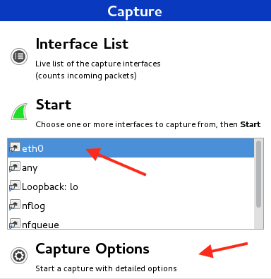
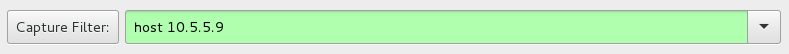
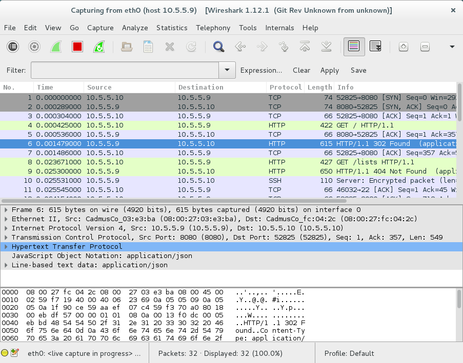
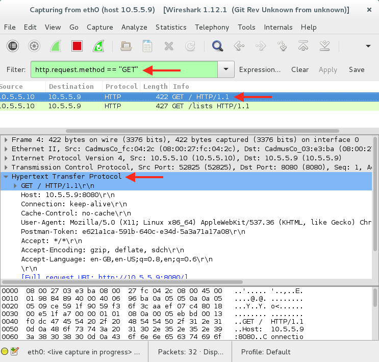
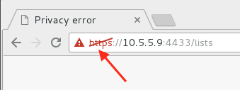
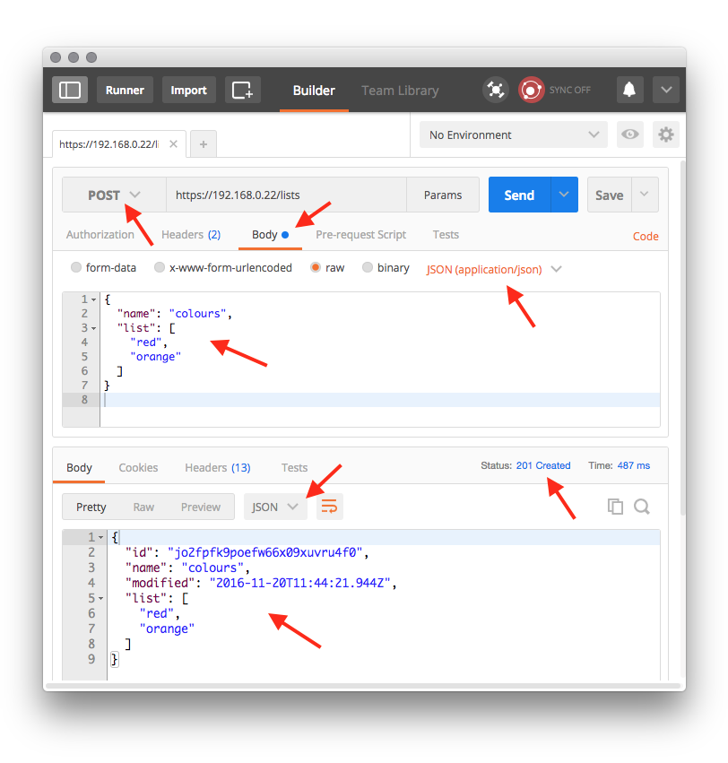

# Simple Secure API

In this lab you will install and run a simple working API that is used to teach the principles of application deployment. The code is on a repository at `https://github.com/covcom/todo.git`.

You will need two virtual machines on the same _internal network_. Start by launching your **gateway** server and make sure both the gateway and DHCP services are running. Link clone a Debian Server and call it **API Server**, this is where you will be running your API and will be referred to as the **server**. The second machine should be your Debian Desktop developer image which will be referred to as the **client**. Make sure both the _server_ and _client_ can connect to the Internet.

### Configure the client

You will need to install **Wireshark** and the **Chrome Web Browser** on the client if this is not already installed. Wireshark can be installed from the repositories however you will need to download and install Chrome manually.
```
sudo apt-get install wireshark

wget https://dl.google.com/linux/direct/google-chrome-stable_current_amd64.deb
sudo dpkg -i google-chrome-stable_current_amd64.deb; sudo apt-get -f -y install
rm google-chrome-stable_current_amd64.deb
```
You will need to modify the permissions before running _Wireshark_.
```
sudo addgroup -system wireshark
sudo chown root:wireshark /usr/bin/dumpcap
sudo setcap cap_net_raw,cap_net_admin=eip /usr/bin/dumpcap
sudo usermod -a -G wireshark newuser
```

### Configure SSH on the Server

Log into the _server_ and install `git`, `sudo`, `curl` and `openssh-server`. Make a note of the _server_ IP address.

There is already a user called `newuser` (with a password of `raspberry`) but they need to be added to the _sudoers_ group.
```
usermod -a -G sudo newuser
```

## Cloning the Repository

Use the `terminal` application on the _client_ to SSH to the _server_ using the `newuser` account.
```
ssh newuser@10.5.5.9
```
Once you are connected to the _server_, you will need to clone the repository
```
git clone https://github.com/covcom/todo.git
```
This will create a new directory called `todo/` on the _server_, **Navigate into this directory**.

## Installing NodeJS

You will need to install the Node Version Manager tool which you can then use to install the latest stable version of NodeJS `node` and the Node Package Manager `npm`. Once this is installed you need to install the packages specified by `package.json`. Finally we can run the NodeJS API.
```
curl -s https://raw.githubusercontent.com/creationix/nvm/master/install.sh | bash
source ~/.bashrc
nvm list-remote
nvm install 7.1.0
npm install --only=production
node index
```
The script specifies that the default port used by the API is `8080`. Open the Chrome web browser and access the root of the API (remember to substitute the IP address of your server):
```
http://10.5.5.9:8080
```
You will get a response to state:
```
{"message": "no lists found"}
```

### Specifying a Port

By default the server runs on port 8080 as defined in the defaultPort constant in the script. If we want to run the server on a different port we have two options:

1. change the value of `defaultPort`
2. define an environment variable on the server

The risk of allowing a developer to specifiy the port for a service is that this port would need to be configured on the network which creates additional work for the system admin team. The second option is therefore preferred. This allows the systems admin team to configure their preferred port by defining an environment variable. The developer then needs to incorporate this variable into their script.

Stop the API using `ctrl+c`, define a new environment variable called `PORT` and assign it a value of `8000`. This is added to the `.profile` file in the home directory, then this data is loaded. Finally we print the contents of the variable.
```
"export PORT=8000" >> ~/.profile
source ~/.profile
echo $PORT
```
Restart the API using `node index`. Now the API can be accessed on port `8000` rather than `8080`.

## Packet Sniffing

The _server_ is listening for incoming http requests and sending responses over an unencrypted connection. This means the data packets can be intercepted and read. We are going to learn how this can be done using a tool called `wireshark`.

Open the **Wireshark** app and choose the active interface your _client_ is using to connect to the rest of the network. In our case this is `eth0`. Now click on the **Capture Options** button.



In the **Capture Filter** box enter the string `host 10.5.5.9`, substituting the IP address of your _server_. Now click on the **Start** button.



Now use the _Chrome Browser_ to access `http://10.5.5.9:8080`.

If you return to the Wireshark interface you will see that it has captured some packets.



1. Under the toolbar you will see a **filter toolbar** which will be used to filter the contents of the _packet list pane_.
2. The **Packet List Pane** displays a summary of each captured packet. Clicking a packet displays details in the other two panes.
3. The **Packet Details Pane** displays details of the selected packet.
4. The **Packet Bytes Pane** displays the data within the packet.

We are only interested in the **HTTP** packets so we can apply a filter. Enter `http.request.method == "GET"` then click on the **Apply** button. Notice how we are now left with only the packets that satisfy the filter.



Select the first row and you will see data for the different layers in the OSI model. If you expand the **Hypertext Transfer Protocol** section you will see the entire HTTP request in plain text. As you select each part of this the bottom pane shows where the data can be found in the packet.

### Test Your Knowledge

1. How much information can you glean about the communication between client and server?
2. Change the filter to `http.response` and investigate further
3. Right-click on the first row in the _Packet List Pane_ and choose `Follow TCP Stream`.

## Running over HTTPS

As you can see, by running over an insecure connection, a packet sniffer such as _Wireshark_ can read the data passing over the network. To secure our connection we need to run our server over an encrypted connection.

### Generating an SSL Certificate

```
openssl req -x509 -newkey rsa:4096 -keyout key.pem -out cert.pem -days 365 -nodes
```

 The `openssl` command takes a **command**. In this case we are using the `req` command specifies we want to generate a _PKCS#10 X .509 Certificate Signing Request (CSR)_.
 
 Open the _man page_ for the `req` command and find out the purpose of the different flags we have used.

 1. the `-x509` flag indicates we are generating a _self-signed certificate_
 2. the `-newkey` flag creates a new 4096 bit certificate using the **rsa** algorithm
 3. the `-keyout` flag specifies the filename to use for the _private_ key
 4. the `-out` flag specifies the _certificate_ filename
 5. the `-days` flag defines the valid duration of the certificate (if omitted, the default is 30 days)
 6. the `-nodes` flag specified that the private key should not be encrypted

Running this command will generate both files in the current directory. These need to be imported into the NodeJS script so that it can handle the secure connection. There is a second script called `secure.js` that loads this data. Open it and find the `httpsOptions` constant near the top of the script.

We can run this using `node secure`.

Once the server is up and running open Chrome and enter the following URL:
```
https://10.5.5.9:4433/lists
```
Make sure you substitute your server's IP address. You will get a security warning because your certificate is not registered.



Click on the red triangle and choose **Details**. Choose **Proceed** to view the page.

### Setting a Port Variable

This uses the default port defined in the script however it looks for an environment variable called `HTTPS` and as a systems administrator you should never rely on default values.
```
"export HTTPS=4000" >> ~/.profile
source ~/.profile
echo $HTTPS
```
Now restart the secure server. It should pick up the new port number.

### Test Your Knowledge

You have already seen how much data can be intercepted when the API communicates over an unencrypted connection. 

1. Use _Wireshark_ to listen in to the communication over HTTPS.
2. How much useful information can you find?

## Using the API

Now the API is installed and running over HTTPS you can interact with it. Open up the **Chrome Postman** tool. This can be installed as either a Mac or Chrome app from https://www.getpostman.com/.

Once open, make sure your API is running then choose the **GET** methos, enter your secure URL and click on the **Send** button. This will send your request to the API.


The response is in JSON format and is displayed under the body tab. Notice that the response code is `404 not found` because there are currently no lists.

### Adding a List

To add a new list we need to POST it. Change the HTTP method from GET to POST then, in the request body add the list name and items in JSON format as shown.
```
{
  "name": "colours",
  "list": [
  	"red",
  	"orange"
  ]
}
```
Now click on the **Send** button. This time you should get the list details back in the response including the last modified date and time plus a unique ID.



If we now make a **GET** request we should see an array is returned with a single index.

Addd a second list, this time for our shopping.
```
{
  "name": "shopping",
  "list": [
  	"bread",
  	"butter"
  ]
}
```
If we make a GET request we should see an array with two indexes.
```
GET https://10.5.5.9/lists

  {
    "lists": [
      {
        "name": "colours",
        "id": "jo2fpfk9poefw66x09xuvru4f0"
      },
      {
        "name": "shopping",
        "id": "uerxmusyle808xaxvs11572os8"
      }
    ]
  }
```

### Getting List Details

We can see the details of the list by making a GET request, specifying the list ID.
```
GET https://10.5.5.9/lists/uerxmusyle808xaxvs11572os8

  {
    "id": "uerxmusyle808xaxvs11572os8",
    "name": "shopping",
    "modified": "2016-11-20T11:52:14.039Z",
    "list": [
      "bread",
      "butter"
    ]
  }
```
