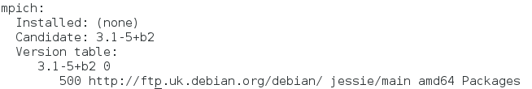
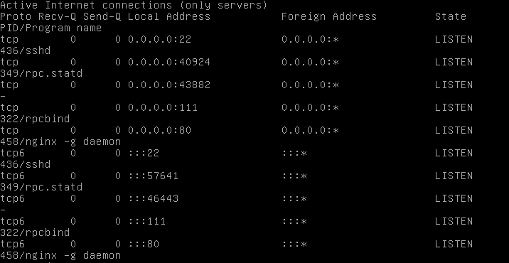
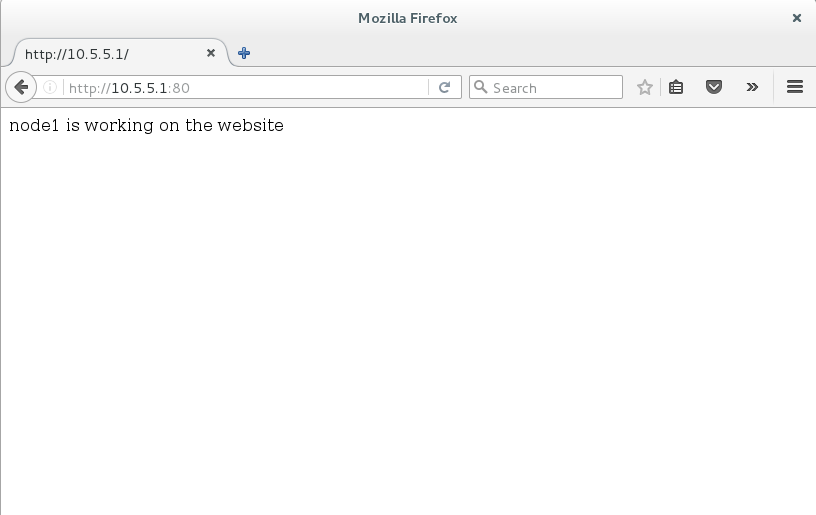
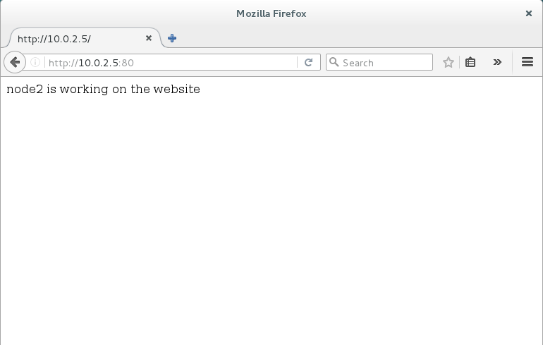

# Clustering and Load-Balancing

This lab intends to demonstrate how to create a simple cluster with load balancing. By the end of the lab you will have a network that consists of the gateway, the master node and the compute nodes.

## Clustering
In the first part of this tutorial, you will go through the set-up of the cluster. This requires the configuration of the servers, the installation of the **Network File System (NFS)**, the set-up of the **SSH** communication between the nodes and the **process manager** of the cluster which is included in the installation package of the **Message Passing Interface (MPI)** that will also be used for this set-up. 

### Building the cluster

The cluster that will be created should consist of the following nodes (i.e. servers/computers):

* gateway
* master node and
* two compute nodes

For this lab you can use the _Alpine_ **gateway** server that you have created in the previous labs. For the creation of the _master_ and _compute_ nodes, you could use the Debian Deskop and Debian Server appliances respectively (the _links_ to download these appliances can be found at the _Cryptography_ section). 

#### Creating the Master Node

To create the _master_ node you need to import the _Debian Desktop_ appliance, name it as **Master node** and reinitialise the MAC address as shown in the figure below. 


#### Creating the Compute Nodes

To create the first node of the two compute nodes of the cluster follow the same way as for the **master** node but this time import the _Debian Server_ appliance instead of the _Debian Desktop_ one. Then, double click on the name tab, name the new server as **Cluster node1**, tick the reinitialise MAC address box and click the _Import_ button to complete the process.


Finally, to create the second compute node you need to make a **linked clone** of the first compute node by naming it as **Cluster node2** and reinitialising the _MAC address_.  

**NOTE:** Before you boot all your cluster nodes up, check that their network adapters are all set to the **Internal Network** configuration.

- - - -

### Configuring the Cluster Nodes

Boot up your **gateway** server and make sure that **DHCP** services are running. After that, boot up all the other servers and log in either as `root` or `newuser` (preferably as newuser).

* To log in to the _compute nodes_, you need to enter the following credentials:
 * `root` or `newuser` as username and
 * `raspberry` as password.
 
* To log in to the _master node_, you need to user `newuser` as username and `raspberry` as password.

Once you have logged in to all the servers, find their IP addressess and keep a note of them (In this case, the IP addresses are: `10.5.5.10` for the _master_ node, `10.5.5.9` for _node1_ and `10.5.5.18` for _node2_). Furthermore, change the name of the cluster nodes by using `nano` to edit their `hostname` file and substitute `debian` for the name of each node. For example, the new hostnames of the master node and the two compute nodes could be `master`, `node1` and `node2` respectively. 

```
sudo nano /etc/hostname
```

You also need to edit the `hosts` file of each node (i.e. master, node1 and node2) using `sudo nano /etc/hosts`. Then, add the following lines after the first two lines of the file. 

```
10.5.5.10 master
10.5.5.9  node1
10.5.5.18 node2
```

Do not make further changes to the `hosts` file, leave the rest of the file as it is, then save the changes and exit the file.
Once you save the file, you can use the host names to `ping` or `curl` the other nodes of the cluster. For instance, check the connectivity of your network using the `ping` command on each server.

```
ping -c 5 master
ping -c 5 node1
ping -c 5 node2
```

Try these commands with different nodes on different nodes. If you have set up your network correctly, you should be able to see the information about the exchanged packages.  

In this tutorial, the master server is used as the master node of the cluster. This means that once the cluster has been set up, the _master_ node will be used to start jobs on it. These jobs will be executed by the two compute nodes, _node1_ and _node2_.   

- - - -

### Defining a user to run the Message Passing Interface (MPI) jobs

At this point, you need to create a new user for each cluster node. This new user account will be used to run the MPI jobs of each node of the cluster. Now, use the following command to create a user with username **jobhandler** and user ID **100** on every server.

```
sudo adduser jobhandler --uid 100
```

It is important that all the MPI users have the same _username_ and _user ID_ on each node for your convenience. For example, the user IDs for the MPI users need to be the same because you will give access to them on the **Network File Systems (NFS)** directory later. Permissions on the **NFS** directories are checked with respect to the user IDs. Furthermore, enter a password for the created user when prompted. It is recommended to give the same password to the MPI user of each cluster node so you have to remember only one password. The above command should also create a new home directory for the created user (i.e. `/home/jobhandler`), which you will use to execute the jobs on the cluster.

- - - -

### Install and Set up Network File System (NFS)

Files and programmes used for the execution of **MPI jobs**, which could run concurrently on the cluster, need to be available to all the nodes that participate in the execution process. Therefore, these nodes need to have access to a part of the file system on the **master** node. **NFS** enables you to mount part of a remote file system so you can access it as if it is a local directory. To install **NFS**, run the following command on the _master_ node:

```
sudo apt-get install nfs-kernel-server -y
```

In order to mount a file system on the compute nodes, the **nfs-common** package should be installed on all the compute nodes of the cluster.

``` 
sudo apt-get install nfs-common -y
```

To share the MPI user's home directory (i.e. `/home/jobhandler`) of the master node (all the MPI jobs will be run there) with the compute nodes, you need to use **NFS**. It is important that this directory is owned by the _MPI user_ of the master node so that all the _MPI users_ can access this directory. But since this home directory has been created using the **adduser** command, it is already owned by the MPI user of the master node. Use the command below to check the ownership of the directory:

```
ls -l /home/ | grep jobhandler
```

Now, share the `/home/jobhandler/` directory of the master node with all the other nodes. For this, you need to edit the file `/etc/exports` on the master node. Use the `nano` editor to add the following line to this file:

```
/home/jobhandler *(rw,sync,no_subtree_check)
```
After having finished with the installation of the **NFS** server on the _master_ node, you may need to restart it as follows:

```
sudo service nfs-kernel-server restart
```

This command also exports the directories listed in the `/etc/exports` file. In the future when this file is modified, you need to run the following command to export the directories listed in `/etc/exports` file of the _master_ node.

```
sudo exportfs -a
```

The `/home/jobhandler` directory should now be shared with the compute nodes through **NFS**. To test this, you should run the command below on any compute node getting as output the shared directory (i.e. `/home/jobhandler *`).

```
sudo showmount -e master
```
All data files and programs that will be used for running an _MPI_ job must be placed in the shared directory of the _master_ node. Then, all the other nodes, with which the master node shares the directory, will be able to access these files and programs through **NFS**.

Now, mount the `master:/home/jobhandler` from the compute nodes (i.e. _node1_ and _node2_) running the following command on each of them:

```
sudo mount master:/home/jobhandler /home/jobhandler
```

If this fails reboot the node and try again. If it works without any problem, then you should be able to see the content of the shared directory of the master node. You could also check if changes to the content of the shared directory are immediately visible to all the compute nodes by creating a new file or directory in it. If mounting the _NFS_ works, you could make it so that the `master:/home/jobhandler` directory is automatically mounted when the compute nodes are booted. To do this, use _nano_ edit the file `/etc/fstab` of each compute node adding the command line below:

```
master:/home/jobhandler /home/jobhandler nfs
```

Reboot the compute nodes and check whether the shared directory is automatically mounted by listing its contents on each compute node when you run the following command.

```
ls /home/jobhandler
```

This should show all the files and directories included in the shared directory `/home/jobhandler` of the master node.

- - - -

### Setting up the SSH communicaton between the nodes

For the cluster to work, the **master** node needs to be able to communicate securely with the compute nodes and vice versa. For this, you should use the **Secure Shell (SSH)** to establish a passwordless communication between the nodes so as to enable the _master_ node to run commands on the _compute_ nodes. This is needed to run the **MPI daemons** on the available compute nodes.

As you have already learnt in one of the previous tutorials/labs (see _Software Deployment_), to set up a SSH communication you first need to install the **SSH server** on all the nodes using the command shown below:

```
sudo apt-get install openssh-server
```
Now, you need to generate an **SSH key** for the _MPI_ users of all the cluster nodes, which will be by default created in the MPI user's home directory. Remember that in your case the _MPI_ user's home directory (i.e. `/home/jobhandler`) is actually the same directory for all nodes: the `/home/jobhandler` directory of the **master** node. Consequently, if you generate an _SSH key_ for the _MPI_ user on one of the nodes, all the other nodes will automatically have an _SSH key_. Let's generate that **SSH key**  for the _MPI_ user of the **master node** (but any node should be fine). In case that you are not logged in as `jobhandler` use the `su` command to switch to it from your current user account and then generate the _SSH key_.

```
ssh-keygen
```

When prompt for a passphrase, leave it empty. This is how you can establish a **passwordless SSH**.

After the key generation, all nodes should share the same _SSH key_. The master node needs to be able to automatically login to the compute nodes. To enable this, the _public SSH key_ of the master node needs to be added to the list of known hosts (this is usually the `authorized_keys` file that is located at `/home/jobhandler/.ssh/authorized_keys`) of all the nodes. But this is easy since all SSH key date is stored in the location `/home/jobhandler/.ssh/` on the _master_ node. Thus, instead of copying master's _public SSH key_ to all compute nodes separately, you just have to copy it to master's own `authorized_keys` file. There is a command to push the _public SSH key_ of the currently logged in user to another computer. Run the follwoing command on _master_ node as `jobhandler`:

```
ssh-copy-id localhost
```

Master's own _public SSH key_ should now be copied to `/home/jobhandler/.ssh/authorized_keys`. To check that all nodes have master's _public SSH key_ in the list of known hosts try to remotely login on the compute nodes from the master node without providing password. Finally, check that you can be securely connected to all the compute nodes using _ssh_. For example, run `ssh node1` and `ssh node2`.

If connected successfully you could `echo` the hostname of the compute node using the following command:

```
echo $HOSTNAME
```

To exit the _SSH_ communication type in `exit` in your terminal or command line.

- - - -

### Installing and Setting up the Process Manager

In this section, you go through the installation of the **process manager**, which is needed to distribute and manage the jobs that run on the cluster. The _process manager_ that will be used in this tutorial is included in the **MPICH** package, so you should start by installing that package on **all the nodes of the cluster** (preferably after updating the repositories). But, before you do this, check the available version of the **MPICH** package as follows:

```
sudo apt-cache policy mpich
```

Runnig the above command, you should get an output similar to that in the figure below.



From the output, you can see that **MPICH** has not been installed yet as the `Installed` label is followed by the indication `(none)`. The `Candidate` informs you that there is only one version available for installation: 3.1-5+b2. It also tells you which repository it comes from. This information is important for the set-up of the **process manager** as the _process manager_ of the _MPICH_ till the version 1.2 was the **MPD** manager, but from version 1.3 and on **Hydra** is used as the default _process manager_ of _MPICH_.   

Now, proceed with the update of the repositories and the installation of the **MPICH** package.

```
sudo apt-get update
sudo apt-get install mpich
```

After that, you can run the following command, **on all cluster nodes**, to check the version of the installed process manager.  

```
mpiexec --version | less
```
In this case, you notice that it is indeed **Hydra** process manager that has been installed (as was expected). The version of _Hydra_ process manager that runs on the cluster nodes is **3.1** (when this tutorial was written).

Now, you will configure the **Hydra** process manager. In order to set up _Hydra_, you need to create a file **on the master** node. This file will contain all the host names of the compute nodes. You can create this file anywhere you want, but for simplicity create it in the **home directory** of the **jobhandler** user of the _master_ node (i.e. `/home/jobhandler`).

```
sudo touch hosts
```

Now that you have created the `hosts` file in the home directory of the _jobhandler_, you need to edit it with `nano` and add the names of the compute nodes in it in order to make the _jobhandler_ user of the _master_ node able to send out jobs to them. Run `sudo nano hosts` command and put the following information into the `hosts` file.

```
node1
node2
```
Once finished, save the changes and exit the file.

In case that you want to consider the _master_ node as a node that will run jobs (i.e. as a compute node), you can add its name in the `hosts` file. If you do that, the master node will also act as a compute node. **Note that** the `hosts` file only needs to be present on the node that is used to start jobs on the cluster, in your case this node is the _master_ node. But since the _home_ directory of the _jobhandler_ of the _master_ node is shared with all the compute nodes, the `hosts` file will also be accessible from them. 

- - - -

### Running Jobs on the Cluster

The _MPICH_ package that you installed earlier comes with a few example application that you could run on your newly created cluster. To obtain these examples, download the **mpich-3.1** source package and extract the archive to a directory (e.g. the home directory `/home/jobhandler`).

```
sudo apt-get build-dep mpich
wget http://www.mpich.org/static/downloads/3.1/mpich-3.1.tar.gz
tar -xvzf mpich-3.1.tar.gz
```

Having finished with the extraction of the downloaded package, you can navigate into the extracted directory, i.e. `cd /home/jobhandler/mpich-3.1` (**Note:** this applies only to the case where you have put this directory into the home directory of the _jobhandler_ user. If you have put the extracted directory somewhere else, navigate into it using the respective path).
This directory should contain an `examples` directory, where you could find the source codes of the example applications. You need to compile these by your own. To do this, run the following commands (while you are in the `mpich-3.1` directory):

```
./configure
make
```

After you have compiled it, you can navigate into the `examples` directory. You will notice that the `cpi` example application is the only application that is compiled by default, so you can run it on your cluster. But, if you want you can build and compile other examples as well like `pmandel`, `hellow`, `parent`,etc. running the following commands in the `example` directory:

```
make pmandel
make hellow
```

Once you have completed the compilation of all the projects, place their executable files somewhere inside the _home_ directory of the _jobhandler_ user of the _master_ node. It is common practice to put all the executables in a `bin` directory, so you could create this directory (i.e. `/home/jobhandler/bin`) and move or copy all these files there making them available to all the other nodes (i.e. the _compute nodes_).

Having moved all the executables to the `bin` directory, you should be able to run one of the example _MPI_ jobs like `cpi`, `pmandel` and `hellow`. Before you run them make sure that you have logged in as `jobhandler` on the _master_ node.

Run **Hydra** process manager to execute the _MPI_ jobs on the cluster. For example use the following command **on the master node** to run the `cpi` job which calculates `π`:

```
mpiexec -f hosts -n 2 /home/jobhandler/bin/cpi
```
Substitute _2_ for the number of compute nodes on which you want to run this job. You could also change the job that the nodes will work on by replacing `cpi` with another job. Try to run all the available example jobs to see what they are doing. Finally, if you want to test the cluster that you set up, you can run software tools or programs making it more realistic. 

- - - -

## Load Balancing using Nginx

In this part of the tutorial you will set up a load balancer for your internal network using **nginx**. For this, you need to use three servers, the `gateway` and the two `compute nodes`. In this scenario, the _gateway_ will act as your **load balancer** and the _compute_ nodes will be the **web-servers** of the internal network. 

### Configuring the Web-servers
First, install **nginx** on your compute nodes _node1_ and _node2_ (if not already installed).

```
sudo apt-get install nginx -y
```

Afterwards, check if _nginx_ is running on your nodes using the `netstat` command.

```
sudo netstat -ntlp
```

You will notice that `nginx` is listening on `port 80`, which is the default port for the `HTTP` traffic as shown in the figure below.



Now, replace the content of the default _nginx_ webpage with the name of the node that you work on. **Apply this to all the web-servers of your network**. The _nginx_ webpage should, by default, be located at the `/var/www/html` directory. 

```
uname -n | sudo tee /var/www/html/index.nginx-debian.html
```

Changing the content to the names of the web-servers it will help you later on to identify the server that runs a job and also to understand how the load balancing works.

Now, make a request to the web-server of your choice to check whether you can `curl` it. If `curl` package is not already installed on your servers, install it using the `apt-get` command. To _curl_ a web-server from the internal network, you need to use its IP address. Check that you can curl your web-servers from any other node. For example, you could curl a web-server either curling from another node or from itself.

```
(from another server:) curl 10.5.5.18
(from itself:)         curl localhost 
```
You should get the content of the _html_ page in response (i.e. the name of the server that your curl).

### Configuring the Load Balancer

Install **nginx** on your gateway server using the command below:

```
sudo apk add nginx
```

If installation fails perform an update to the _gateway_ server (i.e. `sudo apk update`) and try again. Once _nginx_ has been installed, edit its configuration file.

```
sudo nano /etc/nginx/nginx.conf
```
Delete everything that is in the configuration file and add the following lines of code. Alternatively, you can amend this file so as to be like below.

```
events{

}

http{
   upstream web_backend{
   server 10.5.5.9:80;
   server 10.5.5.18:80;
   }
   
   server{
      listen 80;
       
      location / {
          proxy_set_header X-Forwarded-For $proxy_add_x_forwarded_for;
          proxy_pass http://web_backend;
      }
   }
}
```
In the above code, first you define the backend web-servers by listing their IP addresses, i.e. the IP addresses of `node1` and `node2` (substitute the IP addresses mentioned above for the IP addresses that apply to your case). Next, you tell _nginx_ to pass all the traffic to those servers using the **Round-robin (RR)** algorithm by default. Save the changes and exit the file.

Reload the configuration for _nginx_ on the _gateway_ server using the `nginx -s reload` command. If _nginx_ has not started, use `service nginx start` to make it start.

After that, make sure that **SSH** and **DHCP** run on the _gateway_. Now, try to make a request (i.e. `curl`) to the **load balancer** from an internal node that is not a web-server node. For this, you can use the **master** node from the first part. Before you `curl` the _gateway_ internally, you should **reboot** all the internal nodes.

```
curl 10.5.5.1
```
Repeating the same request for a couple of times, you will notice that the **Round-robin** algorithm works alternating between the backend servers `node1` and `node2`. Let's try to curl the _public IP address_ of the _load balancer_ from the _master_ node again to see if it works.

```
curl http://10.5.5.1:80
```

You can also use a web browser to reach the _public IP address_ of the _load balancer_. Open your browser and type in the _public IP address_. You should get the name of one of the web servers in response each time you refresh the browser. 



Now, use an external server to curl the _external IP address_ of the _load balancer_ (for the network of this tutorial, the external IP address of the _load balancer (gateway)_ is `10.0.2.5`).

```
curl 10.0.2.5 OR
curl http://10.0.2.5:80
```
Using the browser of the external server this time, you should be able to see that the web-server alternate each time that you refresh the web page that refers to the external IP of the _load balancer_ (i.e. `http:10.0.2.5:80`).



**Note that** you should get the same response when you make a request either from an internal or external server.

- - - -
